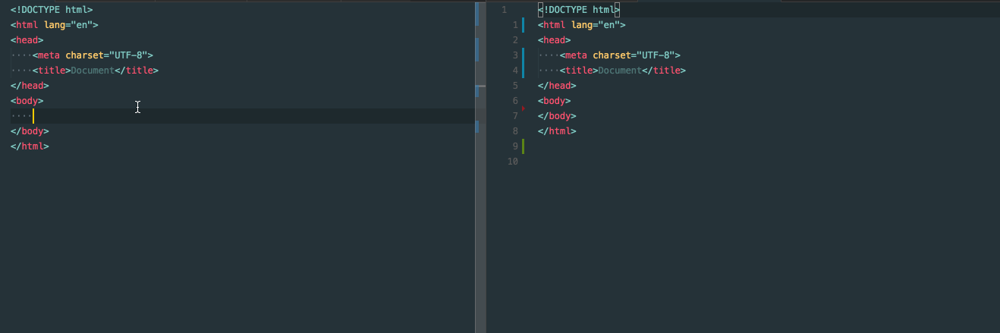

# posthtml-bemy 

[![NPM][npm]][npm-url]
[![Deps][deps]][deps-url]
[![Build][build]][build-badge]
[![Standard Code Style][style]][style-url]

[](https://nodei.co/npm/posthtml-bemy/)

This plugin improves the tiredness of writing HTML with [MindBEMding](http://csswizardry.com/2013/01/mindbemding-getting-your-head-round-bem-syntax/)
 using the power of [posthtml](https://github.com/posthtml/posthtml).



 This plugin is a different way than respecting [posthtml-bem](https://github.com/rajdee/posthtml-bem).  
I recommend that you examine the difference of the method with posthtml-bem.

Before:
``` html
// Block appends "_" to the prefix.
// Element appends "__" to the prefix.
// Modifire appends "--" to the prefix.
// Yes!! You don't have to add "Block" to the "Element" or "Modifire" prefix!!
<div class="_block --modifire">
    <div class="__element --modifire">
        <div class="_block-child">
            <div class="__element-1">1</div>
            <div class="__element-2">2</div>
            <div class="__element-3">3</div>
            <div class="something">something</div>
        </div>
    </div>
</div>
```

After:

``` html
<div class="block block--modifire">
    <div class="block__element block__element--modifire">
        <div class="block-child">
            <div class="block-child__element-1">1</div>
            <div class="block-child__element-2">2</div>
            <div class="block-child__element-3">3</div>
            <div class="something">something</div>
        </div>
    </div>
</div>
```

## Install

> npm i posthtml posthtml-bemy

## Usage

``` js
const fs = require('fs');
const posthtml = require('posthtml');
const posthtmlBemy = require('posthtml-bemy');

posthtml()
    .use(posthtmlBemy())
    .process(html/*, options */)
    .then(result => fs.writeFileSync('./after.html', result.html));
```

## Options

| name | description | type | etc |
| --- | --- | --- | --- |
| `prest` | structural css naming style. <br>the block prefix is "`_`". | 'suitecss' | default: 'bem' |
| `blockPrefix` | the prefix of the name representing the `block` in BEM. | string | default: '_' |
| `elementPrefix` | the prefix of the name representing the `element` in BEM. | string | default: '__' |
| `modifirePrefix` | the prefix of the name representing the `modifire` in BEM. | string' | default: '--' |

suitecss prefix

```js
// blockPrefix: "_"
// elementPrefix: "-"
// modifirePrefix: "--"
posthtml()
    .use(posthtmlBemy({ preset: 'suitecss' }))
    ....
```

custom prefix

```js
posthtml()
    .use(posthtmlBemy({
        blockPrefix: '@',
        elementPrefix: '---',
        modifirePrefi: '___'
    }))
    ....
```

### License [MIT](LICENSE)

[npm]: https://badge.fury.io/js/posthtml-bemy.svg
[npm-url]: https://badge.fury.io/js/posthtml-bemy

[deps]: https://david-dm.org/yoshidax/posthtml-bemy.svg
[deps-url]: https://david-dm.org/yoshidax/posthtml-bemy

[style]: https://img.shields.io/badge/code%20style-standard-yellow.svg
[style-url]: http://standardjs.com/

[build]: https://travis-ci.org/posthtml/posthtml.svg?branch=master
[build-badge]: https://travis-ci.org/yoshidax/posthtml-bemy?branch=master
